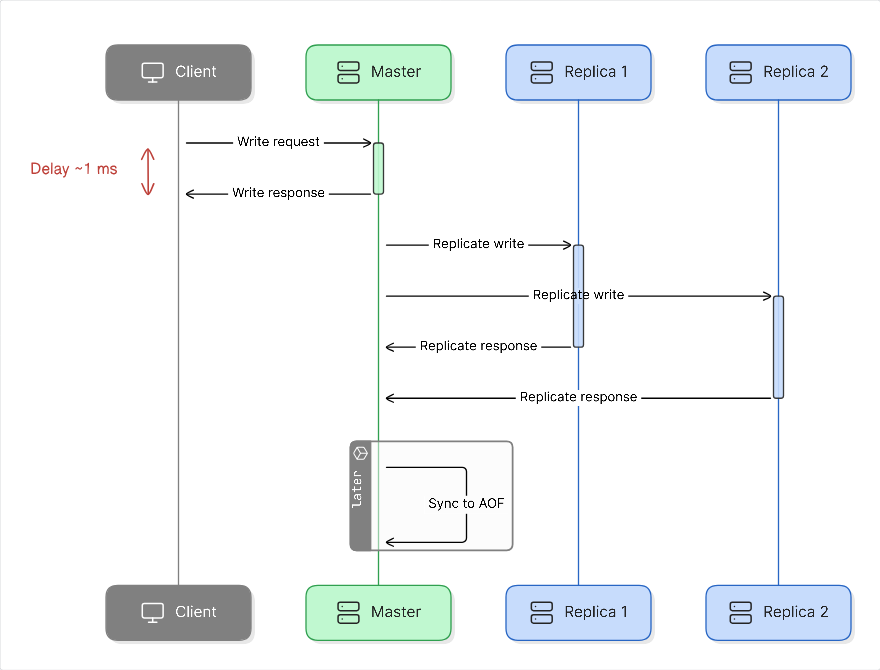
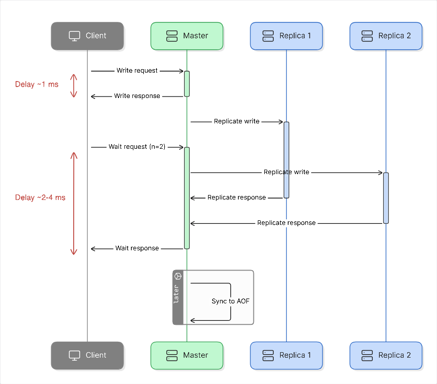
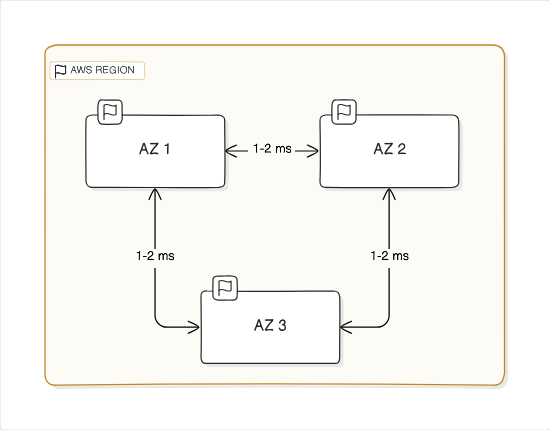
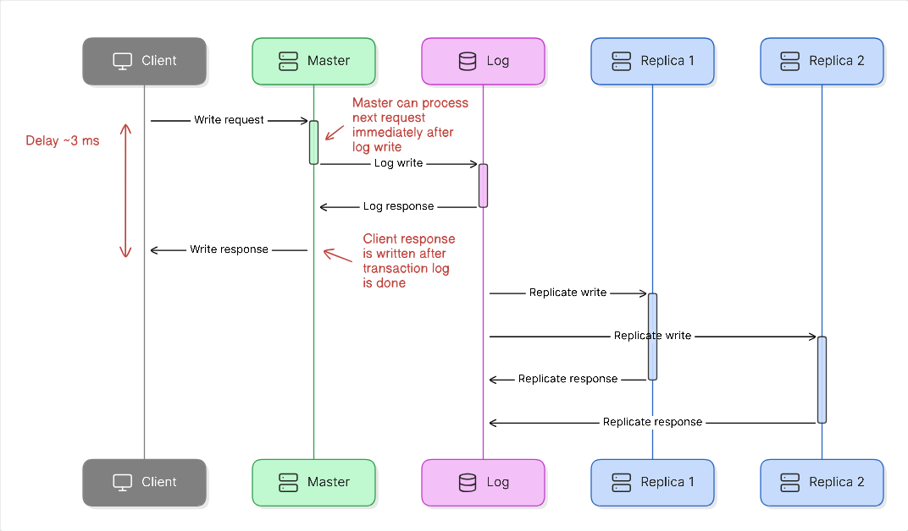

+++
title = "Redis + Strong consistency = AWS MemoryDB"

[taxonomies]
categories = ["cloud"]
+++

[Redis](https://redis.io/) (or the fully open source [Valkey](https://valkey.io/)) is a very versatile and fast in-memory data store. Read operations take microseconds, and write operations generally take 1 millisecond. s take microseconds, and wrIt started as a very simple key-value database, but it has picked a huge number of commands and features over the years. There's plenty of different datatypes, including streams and JSON. There's also embedded functions written in Lua, which are fully transactionally isolated, so it's possible to do complex transactional operations with the minimum of data transfer. It's no longer just a cache, it's a full blown database that is suitable for a wide variety of uses. In short, Redis is an extremely useful tool for any fast state you might require that cannot be locally stored in memory.

The biggest drawback for using Redis for anything else than a simple in-memory cache is that it doesn't provide strong consistency. Under normal operation, when a master is stable, Redis is very consistent as everything happens just in-memory and it is single threaded. But everything being in-memory means that Redis will acknowledge successful writes before they have been persisted anywhere, which means that if the master goes down, you might lose just written data. Redis can be configured with a number of different options for persistence, but most commonly it writes to an AOF (append-only-file) once per second.

To combat this, there is the `WAIT` command which can be used to wait until a certain number of replicas have acknowledged the write, which means that at least it's not up to just a single machine anymore. This doesn't mean that it would be synchronized to disk necessarily (for example if all replicas lose power / crash at the same time), but if they are independent enough it's quite likely that at least one replica will persist the data to disk. But even then there are no actual guarantees that a replica being promoted would have all the data. It tries to promote the replica with the most up-to-date state, but given that failure scenarios are often quite complex, it's still just best-effort consistency. In the worst case, a replica could be promoted that doesn't have _any_ data, so the whole database would start from scratch.

But what if I told you there's an alternative (if you are on AWS)...

## AWS MemoryDB
MemoryDB is a Redis OSS compatible database that claims to offer both durability and strong consistency, while keeping the fast in-memory performance of Redis. That sounds almost too good to be true. _So how do they do it? Is it really compatible with Redis? What are the guarantees they provide?_

### Consistency
What MemoryDB promises is that the moment a write operation completes, that write operation is durably persisted (eleven nines, just like S3) and strongly consistent, meaning that no operation will be run on the database without that change present. This means it acts like any ACID database with SERIALIZABLE isolation level - that's everything one could hope for. This is exactly the same as Redis offers by default if the master is stable. It's still single threaded.

### Speed
_But it can't do that while keeping the exact same speed that Redis has, can it?_ Well, no, obviously it can't, since Redis answers immediately after something has been written to memory only on a single machine. But it can get surprisingly close.

First of all, read operations are not affected at all and exhibit the same performance as with Redis, as is to be expected. Well, to be exact, it's even a bit better than Redis, but that's due to Amazon optimizing the database for their hardware with some enhanced IO multiplexing. So the response times for both databases are in microseconds - this is an in-memory database after all.

Write operations in Redis will complete usually in 1-2 milliseconds. For MemoryDB that same figure is 3-5 milliseconds. That's obviously slower, and a meaningful difference, but still quite a bit faster than what most databases can manage. It's pretty much on par with a normal write + `WAIT`  for Redis. Especially if there's any network latency in general, a couple more milliseconds will end up fully hidden in that latency.

This figure is also pretty much exactly the optimal result one can theoretically achieve, while keeping the same availability approach. In order for the data to be durably persisted, it needs to be stored in multiple data centers. In AWS this means multiple availability zones inside a region (an availability zone might actually have multiple data centers, close by, as they are huge). These availability zones are physically located at least a few kilometers away from each other and a maximum of 100 kilometers. The networking round-trip latency is less than 2 milliseconds, but can't be instant, because the speed of light isn't instant. Hence if Redis takes 1 millisecond to process the operation, and getting the same operation delivered to two other datacenters takes a 2 millisecond round-trip, we arrive exactly to the 3 millisecond minimum time.

### Implementation
_So how do they do it?_ They add a strongly consistent transactional log into the normal Redis codebase, where the implementation of the log is AWS secret sauce. The transactional log is placed after the normal in-memory operation for Redis, so once the operation is done, the results of the operation are committed into the log and will end up getting relayed to the replicas. And each replica will always ensure it has the entire log replayed before it can become a master.

But if this were done naively, then every write operation would end up taking three times as long because of the transactional log, which would reduce the throughput of the entire database similarily. But that doesn't seem to be the case as total throughput, while less than a standard Redis installation, is quite close in the end. _So that can't be the way they do it._

What they actually do is that they only delay the sending of the acknowledgement message after a command until they have received an acknowledgement from the transactional log. This means that the database itself can actually perform operations at full speed in the in-memory database, and only the clients are delayed until there is confirmation that the data has been durably persisted and will be strongly consistent. This is quite a cool idea, and it's easy to reason about the performance knowing this.

### Compatibility
Everything else about Redis stays the same, as everything is first executed in-memory and then written to the transaction log. So we know it supports all the same stuff as Redis does without having to reimplement everything and keeping all the quirks that we've already gotten used to (unliked some... krhm... DocumentDB). And they've added the same JSON support that's currently part of the not-so-free Redis offering.

Replication in Redis is also a very standard feature and thoroughly battle tested. This solution just improves the behaviour around the replication stream, but the actual data elements are the very same. So we don't have to worry about new quirks around randomness or functions or other similar things appearing, but those will still be just like they are in Redis.

### Cost
AWS offers the standard Redis as well, under the name Amazon ElastiCache with Redis OSS compatibility. This makes it easy to compare the prices of that against MemoryDB. Comparing the costs for on-demand instances, they seem to be charging around 40-50% more for the same instance types. Given that Redis costs are usually quite low compared to the value they bring, that isn't too bad.

In addition to that, there's a cost of $0.20 / GB for data written. This is obviously to cover the cost of the transactional log. Usually Redis is read heavy, and the written data elements are quite small. Evaluate your use case thoroughly, but I would wager a guess that this cost is also not prohibitively expensive.

### Summary
Overall, this gives a very interesting new choice for development. Usually anything that requires strong consistency has had to have been implemented with DynamoDB, or some other real database. And that has a cost per transaction that may get significant. Anything read heavy, or more ephemeral, would then be handled by Redis where the cost would simply be based on the dataset size (the memory size of the nodes).

MemoryDB allows us to get pricing that's based on the dataset size, and not the amount of operations, for a strongly consistent database. A database that is in-memory speed for reads and nearly in-memory speed for writes. I'm betting that's quite an interesting proposition for a number of developers.

Now if they would just add cross-region replication...

<!--- Eraser file: https://app.eraser.io/workspace/KoSBBMGFSpKInsUpJSNv --->
