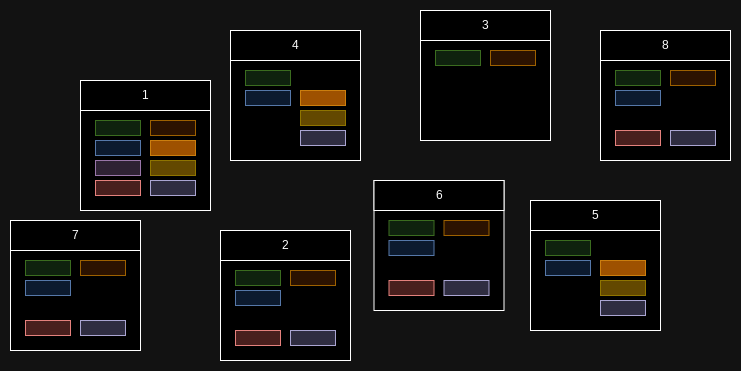
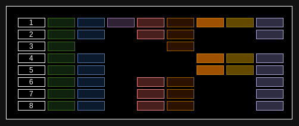
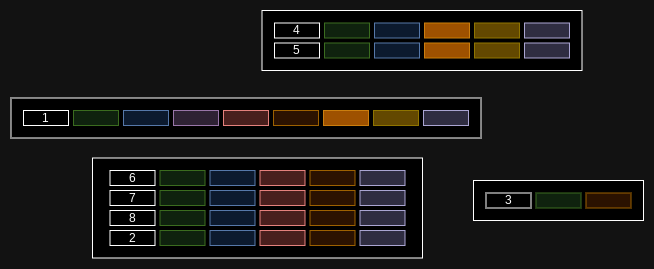
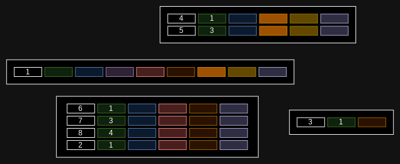
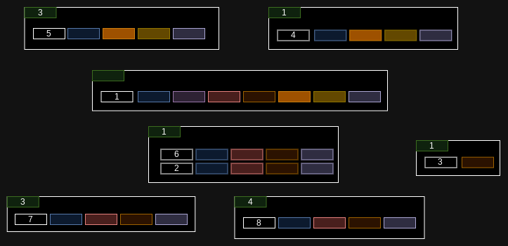

+++
title = "Reconsidering fragmenting relationships in Bevy"
draft = true

[taxonomies]
categories = ["fun"]
+++
I want to give my own opinion about implementing fragmenting relationships in Bevy. I am not convinced that they are the only, or the best, solution to the whole relationships issue – but I also don't know if I'm right at all. So, this is just putting my view out there, and seeing if it makes sense to anyone else.

## What's an archetypal ECS?

In a basic C++ game engine, each game object is their own allocation. The engine might have objects that do everything based on some flags, or might have different classes for different types of objects using inheritance etc. A lot of games right now do not use an ECS, and that's fine – the games perform very well. But this places a heavy burden on the system allocator to perform well, and it's not really friendly to the cache as each object is littered randomly in memory.

An ECS is a system where each game object (entity) is composed of individual component objects. These component objects are all exactly the same class, so the same size with just different data, so they can be stored efficiently in an array. The game logic is then implemented as systems which apply to all objects which have certain components. This is very cache friendly, as the operations linearly traverse through the relevant components and handle all of them in a single batch. So, strictly speaking, we have one array per component type, and then we need a way to map from entities to all these component arrays.

An archetypal ECS takes this a step further. It automatically defines an archetype for each combination of components that an entity might have. This has two benefits. First of all, it means that an entity's components can be looked up by just archetype id and then index within that archetype. Second, it means that it's easy to find entities which have a certain set of components, as all you have to do is to find all archetypes which contain that set of components and then iterate through those. So this means that in an allocation sense, each archetype will have separate array or arrays. The entity could be stored as one tuple with all the components in a row, as they all have the same set of components, but more commonly each component is still stored in a separate array. This is because not all traversals need all components, so the cache will end up only caching the relevant components when they are being traversed.

The archetypal ECS is a very good performance boost for games which handle a lot of entities. It is very cache friendly as components are read in bulk by the systems that operate on a single set of components at a time. It is also a kind of an indexing system for which components are present as the archetypes act as indexes at the same time. As long as there isn't a huge number of different archetypes, it's quite optimal – and quite popular in the games these days.

## Where does the archetypal ECS fall short?

Entities in a game often have relationships, meaning that they point to other entities. A typical use of this is a parent-child relationship, where a child entity has a parent entity. This is often used with a transform component, where the child entity's position and transformation is relative to the parent entity's position and transformation. In an ECS, this is represented by components that contain entity ids. When traversing this entity id reference, you first need to look up where the entity is from an entity id table which tells the archetype and the index, and then look up the components from the archetype data arrays.

Generally this isn't a problem and performs reasonably well. But when the main traversal for a system, such as with the transform component, is based on this system it means that the components that are read are no longer linearly laid out in memory, but instead possibly accessed in a random fashion. This means constant cache misses and can tank the performance of the whole engine.

## Flecs solution: fragmenting relationships

Flecs has a solution for this. It's called fragmenting relationships. The idea is that instead of components only being able to be in an archetype, also relationships with an entity can be in the archetype. So, to simplify, it means that each parent entity gets its own archetype. This means all the children for that parent are in a neat array, so when traversing the tree of entities based on that relationship, it will again be cache friendly as the components are laid out linearly in memory. This solves the traversal problem very well and has really good performance in general, so it's obviously a reasonable solution.

It's not without its faults though. If the amount of children per parent is low, it means there's not much linearity benefit to this approach as the entities end up dispersed in memory anyway. Also, FLECS allows fragmenting relationships along multiple components, which means that if there are two orthogonal relationships, then having an architype for each combination of these orthogonal relationships will lead to a huge number of archetypes. And a huge number of archetypes makes it hard again to find all the entities that have a certain set of components, which can be mitigated with different sort of indexes on archetypes.

Which is all to say that in the pathological case, the fragmenting relationships approach degrades to just a normal game engine with separate allocations for each object – which is still good! And there's a ton of [optimizations](https://x.com/ajmmertens/status/1639725947258822656) that can be done to minimize the downsides. Like said, most engines do not really use an ECS and they perform well.

## So what's the issue then?

I personally think that using archetypes for relationships goes against the grain of what makes an archetypal ECS tick. Instead of having just finite set of archetypes based on the components used, there's suddenly thousands or more of them, which transforms the engine from being an archetypal engine where all the objects of a certain shape are in a single array (or one array per component) to something more of an object oriented system where the children of an object are stored separately, and there's just a lot of objects.

Most systems traverse through components fully unordered, as they only affect the object itself. Or if they involve multiple objects, they are involved in a way where relationships cannot be utilized in the iteration, like collision detection for example. Only a very small number of queries primarily travel along the relationship axis, like the global transform systems which trigger only when a transform is modified. Yet all of these other queries will be hit by the performance penalty of having possibly thousands of archetypes to go through.

The speed benefit from the fragmenting relationships is only realized when specifically traversing downwards on a one-to-many relationship – which is what nested transforms obviously are. There are of course other relationships which are used similarily as a tree, where it is equally beneficial. But if the relationship is in any way different, the traversed entities will no longer be linear in memory. Which means that the benefits are only fit for a specific use case, where as other solutions might be able to optimize for a wider range of use cases.

Also, it feels unintuitive for Bevy specifically, and instead feels like a solution being bolted from an entirely different ECS, Flecs, to an engine that is built differently. While I wholeheartedly applaud the work done in Flecs, I'm not convinced that all the solutions are also best fit for Bevy – especially since Flecs has Rust bindings as well, so if one wants those solutions in Rust, they are available.

## Alternative solution for Bevy: sorting!

The performance problem with the parent-child relationship is that the components are not linearly laid out in memory, leading to cache misses and random traversal. But what if we would lay out the components so that they would actually be in traversal order?

The order of entities in an archetype is essentially random, as it's based when the entity has been inserted in that archetype. The same entity will always change positions in the archetype arrays when moving between different archetypes. Currently the order of entities inside an archetype is not really useful for anything. So what we could do is to sort the entities for an archetype based on the parent. This way, when traversing the parent-child relationship, all the children of a single parent would be laid out linearly in memory. When sorted, it would give the same benefits as the fragmenting relationships approach, but inside a single archetype where all the arrays are continguous. This means that there wouldn't be one memory allocated array per component per parent, but instead one memory allocated array per component, which is even more optimal for this case.

This approach would also mean that when traversing entities by some other order, it will just degrade back to what Bevy is today, instead of exhibiting worse performance as the data is split around randomly in memory in multiple separate allocations. And most importantly, unordered traversal would be exactly as fast as it is in Bevy today, unlike in the fragmenting relationships case.

Changing the order of entities in the archetype is easy, as there are already operations that swap the location of an entity inside an archetype on removal. We just need extend the interface with an operation that swaps the locations of two entities in the same archetype, and then implement sorting algorithms utilizing that operation. This would give us a blocking sort for the entire archetype, where we could use any component as the sorting key – with `Parent` being the right component for the global transform case.

But it's harder to keep the array sorted when new entities are added or removed. Naive implementation would need `O(n/2)` writes when an object is added, or the `Parent` component is mutated. If the rate of churn is low, it might be enough to just periodically sort the arrays. Most of the objects would still be fetched fast as they are linear, and all of the new objects are likely to be at the end of the array so they might also fit in the cache. And there are great sort algorithms which handle semi-sorted arrays efficiently.

But, there will obviously also be the pathological cases where the end result is that most of the time the arrays are not sorted, so cache performance is bad, and then sorting the array takes a lot of comparisons and data writing, which blows all the current caches and also creates a visibly longer frametime for some frame. Experimentation will tell how often this happens in practice.

## Evolution: incremental sorting!

We can sort the whole array at once. If there isn't a ton of entities, it's probably not going to be visible in the performance metrics if we do it every once in a while. But still, it's a big bang memory operation at once, so there are likely to be games where that's not feasible.

What we can probably do is to just sort the array incrementally, some number of elements at a time per frame. It doesn't matter if the end result isn't perfect if some elements get removed for example, as the cache misses will be minimal. They will anyway be handled properly on the next pass. I feel like this `O(n log n)` sorting in the background is probably something that's sustainable for a lot of games and optimizes the traversal more than what is the cost of the constant sorting. Especially if it only affects those entities which participate in the parent-child relationship. A constant overhead per frame is easier to ignore than big sorting operations periodically. There are also many sort algorithms for this sort of sloppy incremental sorting, but they are a bit more esoteric.

However, we might be able to do even better! The basic idea is to sort the archetype per the parent element, which means we declare the parent element to be the primary traversal operation. That's not going to be the case for all queries and not all the games. Also, if we actually look at the implementation of global transforms now, it seems to be a depth-first sort. So leaves will be in good order and cache friendly, but all the middle nodes will not be visited sequentially, which means that simply sorting by parent (or doing fragmented relationships) isn't optimal.

So, what if we could automatically sort the entities based on a query? Meaning that we'd automatically swap the elements to be in the order which the query visits them. Then we wouldn't have to know about the traversal order in advance, we would just need to flag a query as being the main query to optimize for. An archetype can only be sorted in one order anyway (unless we go for really advanced stuff like z-order sorting), so we can't do it for every query.

But, we were supposed to do incremental sorting. So, what if we flag the query to sort the elements as they are traversed, but count the number of swaps actually made, and stop when that count exceeds a number? This way each frame would sort the archetypes a bit more in the traversal order of the query, but not all the way. So, probably cache performance would end rapidly improving even after big changes, but there wouldn't be a big pause as an entire archetype is sorted. And if the traversal order radically changes, then we'd adapt to that in a finite number of frames.

Or, it may be that there's no query that visits everything on order, but instead recursion is used inside the queries, in which case there's no query state to look at. We could instead have triggerable state in the archetypes, where we say that move every fetched element to the correct position on every get by keeping an incrementing counter for the position it should be in. And then we'd have a separate counter on how many moves we have actually performed, and stop doing the moves when that counter exceeds a certain number.

## The nitty gritty details

This is just an idea, and there's no implementation yet. There's a ton of little difficulties to be solved to make something that is actually a performance benefit. For example, trying to sort things strictly in traversal order performs really badly if one element is added to the beginning of the sorted order – we need to swap every element after that to get them to the right place, even though they are almost perfectly sorted already. So, possibly we will need some cache-oblivious algorithms to make sure the tables for each archetype can be mostly sorted while not causing significant memory churn. Perhaps we'd even have LSM tree as a table storage, or cache-oblivious streaming B-tree.

Also, it is skimming over the fact that the reference from the parent to the children isn't a direct pointer. In Bevy, a parent currently has a list of children as a vector of `Entity`. This means that for every child, it's first necessary to go to the global `Entities` vector, and look up the location of the entity (the archetype and the index in that archetype). This may be random seeks in the `Entities` vector, and it's an open question of how much is it in cache generally. In Flecs, every parent is a separate archetype, or combination of parent and child components. These archetypes are indexed in a hash map based on the parent entity id, which means a random seek per parent, but not for every child. The performance differences of these approaches are not obvious as also operation complexity is different, and the tree depth and fan out create very different outcomes.

Ultimately, there's tons of different approaches here that can be tried - and most of it will likely be easily togglable on and off without interfering too much with the existing code. We can start really small, by just adding the swap operation and then implementing a single manually triggered sort. So, if the approach seems to be logically sound then, and we see the performance benefits we are after, then all the rest of the work can progress incrementally and it will either pay off in the end, or it won't – that still remains to be seen.

And of course, if it doesn't work out – this isn't blocking the implementation of fragmenting relationships, so we can always get back on that path. Even if we do fragmenting relations, there's still a chance that for example Z-order sorting of entities based on world coordinates is a performance win. The idea is applicable to many different problems.

## Where to go from here?

The idea is now out there and others can chime in if it is of any value. I will likely be discussing this on the Bevy Discord, so the best way to contact me is to reach out to me there. It will be either in the ECS dev channel or the relations working group. If I get support on this approach, I will possibly write a pull to add a swap operation to the table interface. Then a lot of the testing can be done as external code to Bevy. I will also likely try to get some more performance tests on hierarchies merged to Bevy so that any benefits can be concretely demonstrated.